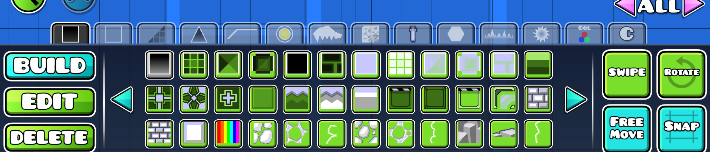
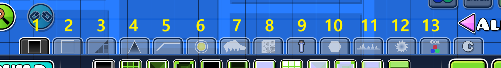
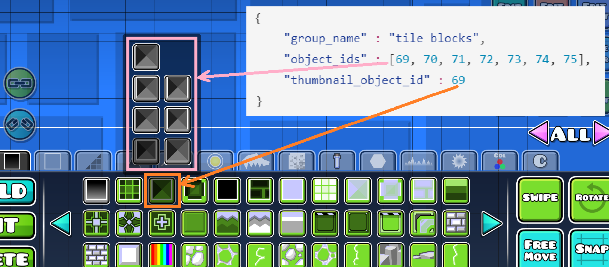
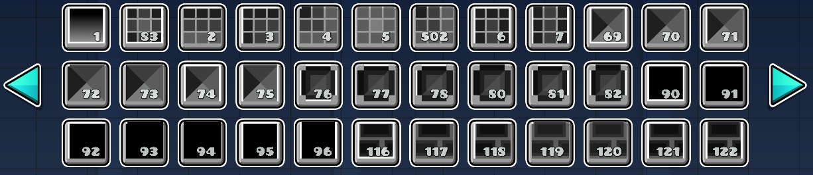
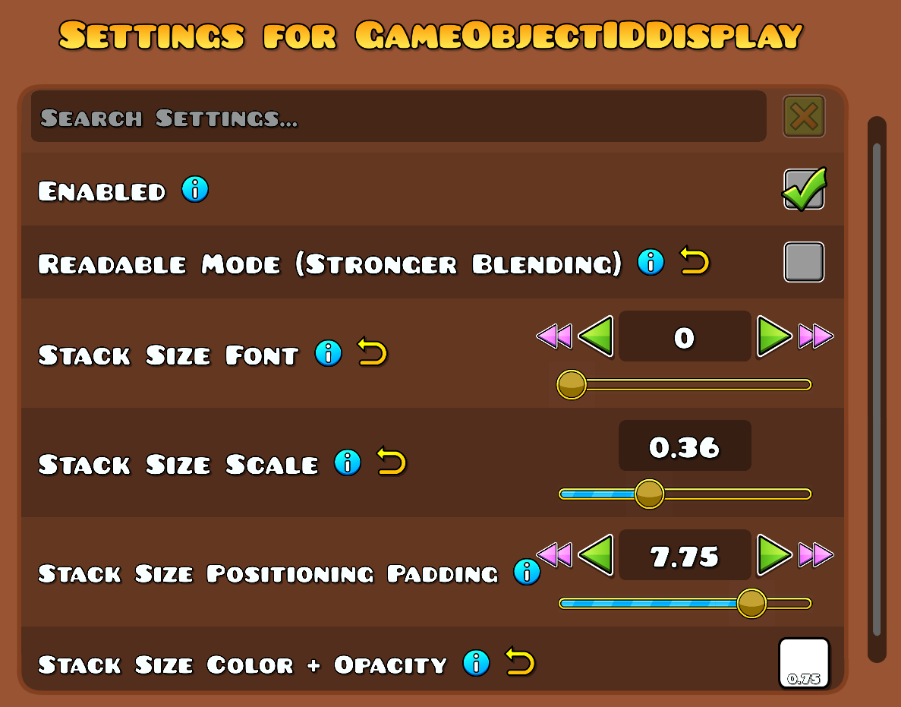

# Configuring Object Groups
```python 
~ 5 min read.
```

With the **Object Groups** mod *by RaZooM*, you can change the way the objects are grouped by editing the configuration file. 

This text will help you understand the configuration file format and learn how to organize objects as you want using this mod.

## Configuration files
This mod uses two configuration files: `custom_config.json` and `default_config.json`. You can find the paths to these files in the mod settings.

Both of these files are created automatically when the mod is first launched and both are initialized with the **default configuration**.

- `default_config.json` - this file stores the default configuration for the mod. **Changes to this file do not affect anything**. The only point of this file is to store the default configuration, so that if you mess up a part of the custom configuration, you could replace that part with the default one. Also, if you delete this file or make changes to it, they will be restored on the next game startup.

- `custom_config.json` - this file is used to configure the mod. **All changes in this file affect how objects are displayed in the GD editor tabs**. By default, the default configuration is written to the file and you can see its effect in the editor:



## File format
The `custom-config.json` file has the following structure:
```json
{
    "config" : [{
        "build_tab_index" : 1,
        "object_groups" : [...]
    }, {
        "build_tab_index" : 2,
        "object_groups" : [...]
    },
        ...
        ...
    {
        "build_tab_index" : 13,
        "object_groups" : [...]
    }]
}
```
Here:
- `config` - a root node for entire configuration (doesn't interest us)
- `build_tab_index` - index of a build tab in editor. Depending on which tab you want to make changes in, you need to make changes in appropriate section of the file. 
Here are the indexes of the editor build tabs:


- `object_groups` - here you specify the groups of the objects of the corresponding objects tab. 

Let's look at `object_groups` in detail:

```json
"object_groups" : [{
        "group_name" : "regular blocks",
        "object_ids" : [1],
        "thumbnail_object_id" : 1
    }, {
        "group_name" : "grid blocks",
        "object_ids" : [83, 2, 3, 4, 5, 502, 6, 7],
        "thumbnail_object_id" : 83
    }, {
        "group_name" : "tile blocks",
        "object_ids" : [69, 70, 71, 72, 73, 74, 75],
        "thumbnail_object_id" : 69
    }
    ...
    ...
]
```
The above code block shows the default configuration for the first three groups on the first editor build tab:
#### Required fields
- `group_name` - the name of the group. It does not affect anything and does not appear in-game. It is only needed for better readability of the configuration file. So feel free to name the groups the way you want, or leave the name empty.
- `thumbnail_object_id` - id of the object that is shown as a group cover.
- `object_ids` - an array of object IDs from the group. 


> [!NOTE]
> In the case of the first group, it contains only one object (`"object_ids" : [1]`), so it is displayed in the editor without a group.

#### Optional fields
- `hide_group` (optional) - hides this group

- `ungroup` (optional) - show objects from this group like they don't have a group (e.g. gravity portals are *ungrouped* on the picture below)

  
> [!IMPORTANT]
> By default, objects from the current tab that have not been added to any group are placed to the end of this tab (after all groups). Using `ungroup` or `hide_group` you can make them appear among the groups or not appear at all.

`hide_group` and `ungroup` syntax example: 
```json
{
    "group_name" : "tile blocks",
    "object_ids" : [69, 70, 71, 72, 73, 74, 75],
    "thumbnail_object_id" : 69, 
    "hide_group" : true,
    "ungroup" : true
} 
```
## Actually changing configuration
After the file format has been covered, you should be able to **actually change mod configuration**.

You can:
- edit existing groups
- make new groups
- hide certain objects
- reorder objects and groups in a build tab
- add unused objects, like *old color triggers*
- group objects from different build tabs
- ~~mess up the configuration file~~
- ~~make the game crash~~

To change the configuration, you need to make changes to the `custom_config.json` file. To see the changes in the in-game, exit and re-enter the editor. The current configuration will be applied.

> [!TIP]
> To edit the `.json` file, I recommend using a text editor with **json syntax support** such as VSCode. 
> Incorrect json syntax will result in an **error** loading the configuration.


## Finding out object IDs
To configure the mod, you need to know object IDs. I recommend using the **GameObjectIDDisplay** *by RayDeeUx* mod for this, which adds object IDs to their images: 

Settings for **GameObjectIDDisplay** mod that I used:


Alternatively, you can use level **Object IDs New** *by Colon* (id=`99784974`). But it is much less convenient.

> [!WARNING]
> Specifying the id of a **non-existent object** in the configuration file will result in a **game crash**. (Ids of unused objects, like *old color triggers*, are fine)

***
Thanks for using my mod ❤️
*RaZooM*


