# Object Groups Gallery (v2.0.0)

### Object Groups allows you to create groups of objects in the editor tabs.

- This helps you organize objects and reduce the space they take up.

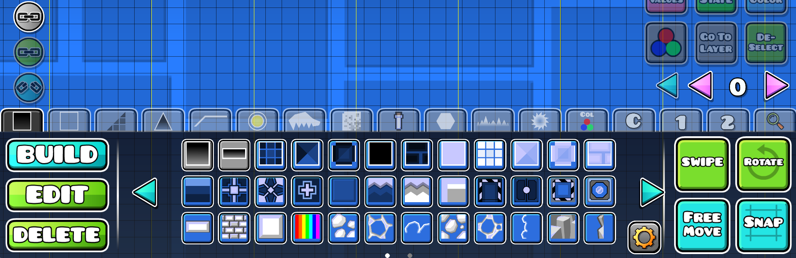

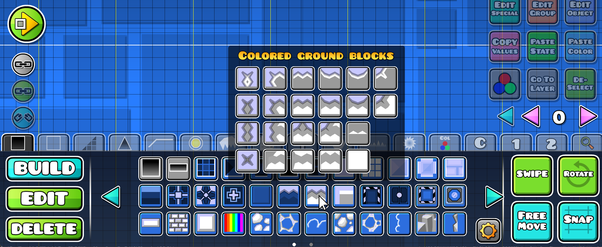

- The mod also allows you to have up to 5 additional tabs for the groups and objects. (you can configure them in mod settings)

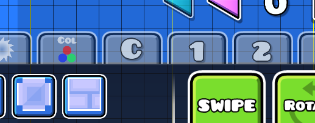

- The mod provides the **default group configuration**, which is already very convenient. Starting from version `v2.0.0`, you can edit it as you want **right in the game**.

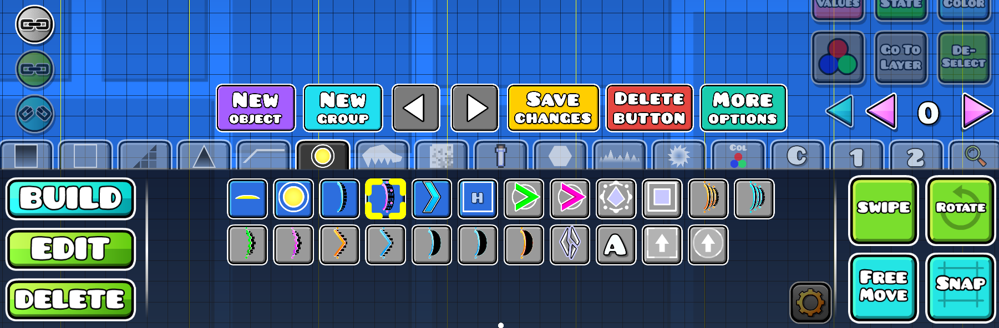

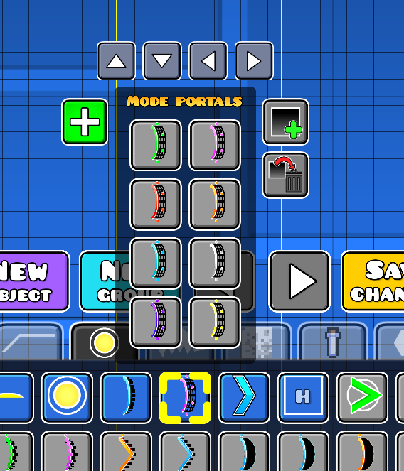

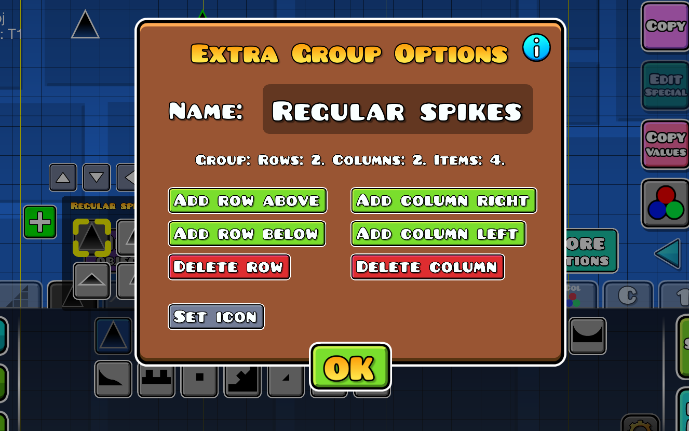

- Starting from Object Groups `v2.1.0` you can **pin** one or more groups in the editor:

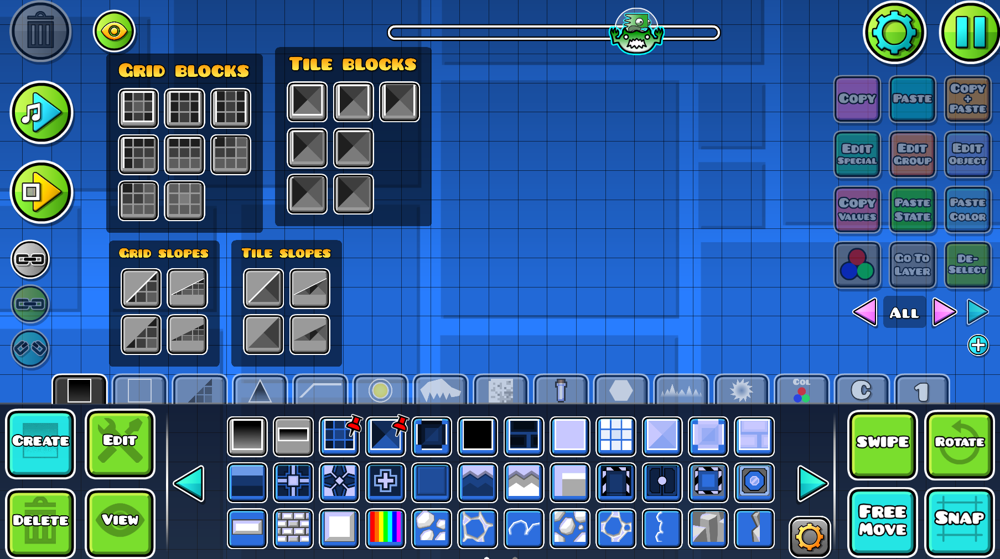

You can drag the across the screen and close them by moving to the edge of screen:

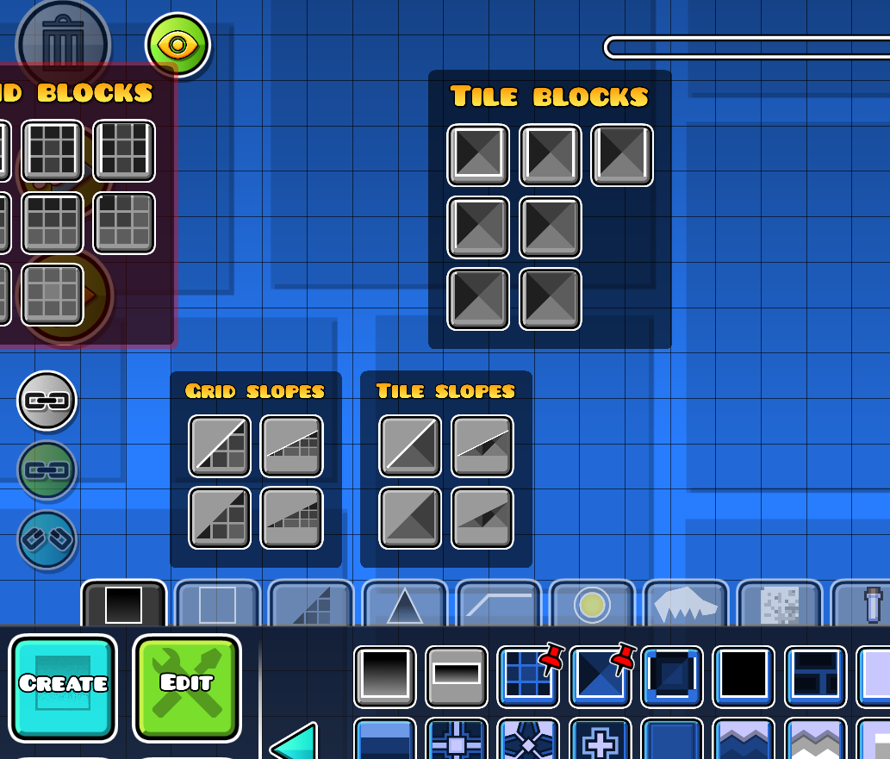

---

### The mod also has advanced functionality, such as:

- Group search (experimental, may be enabled in settings)

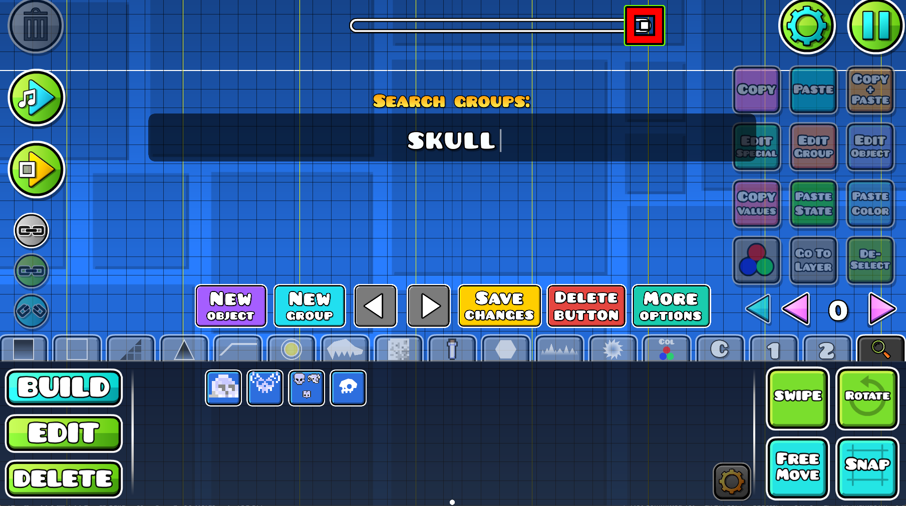

- Changing tab icons to the icons created in editor

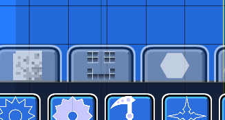

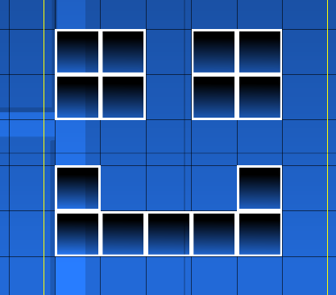

- Setting multiple objects to the group icon

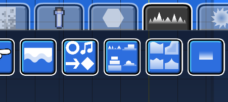

- And others that you can explore on your own.

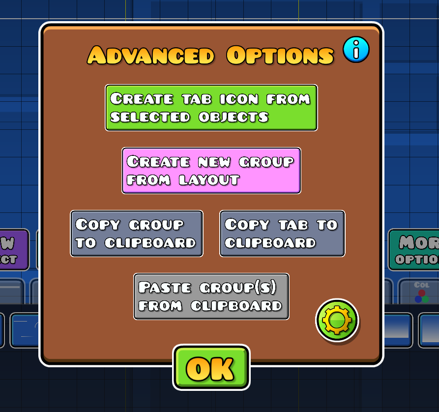
