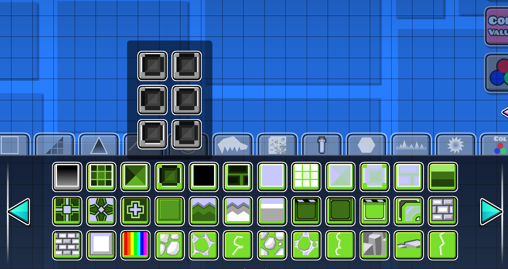

# Object Groups

This is gives you the ability to group objects in the editor tabs.

## How it looks

## Configuring groups

With this mod it is possible to configure groups with a special `.json` file.
You can find more info about it in [this guide](https://github.com/RazoomGD/geode-object-groups/blob/main/changelog.md)

## Compatibilities with other mods

## Known issues
